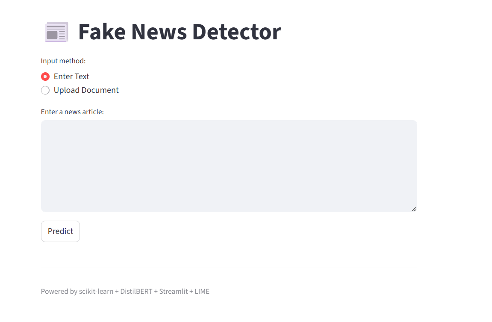
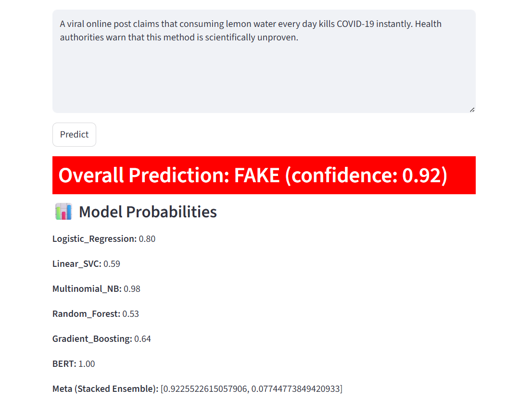
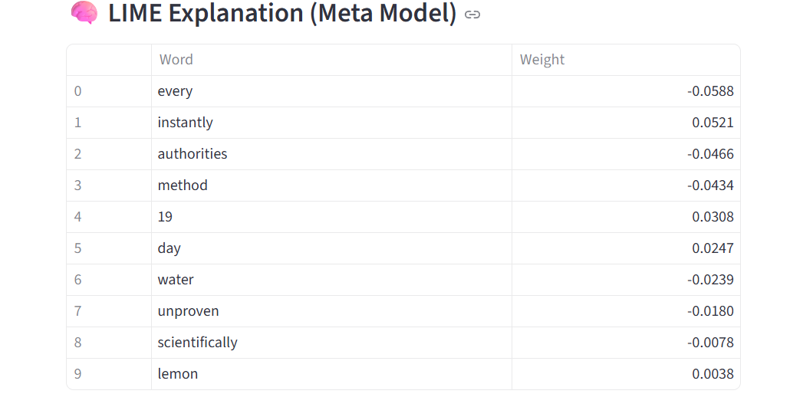
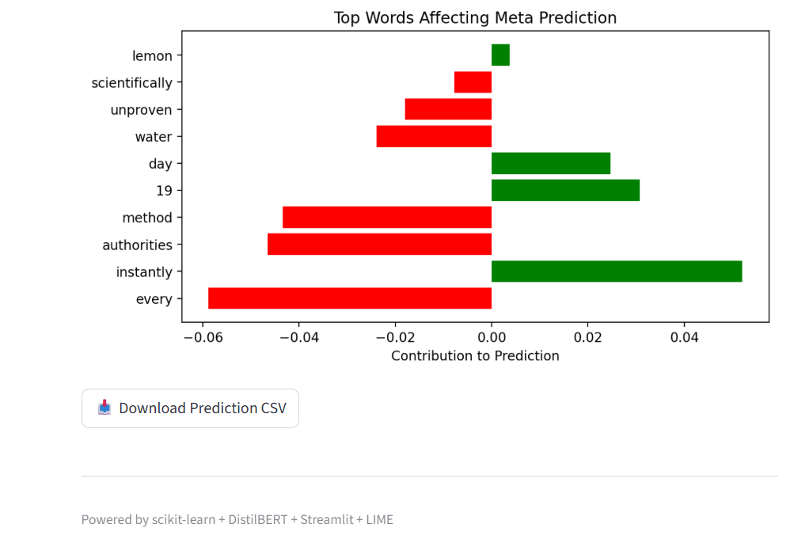

# Fake-News-Detection
A hybrid system to detect fake news articles using Machine Learning and Transformer-Based Model.

# Project Overview
This project is a **Machine Learning-based Fake News Detection System** that classifies news articles as **Real** or **Fake**.  
It is built to help combat misinformation by automatically analyzing news content using classical ML algorithms.

# Technologies Used
- **Programming Language:** Python  
- **Libraries:** scikit-learn, pandas, numpy, matplotlib, seaborn  
- **Algorithms Implemented:**  
  - Logistic Regression  
  - Linear SVM  
  - Multinomial Naive Bayes  
  - Random Forest  
  - Gradient Boosting  
- **Evaluation Metrics:** Accuracy, Confusion Matrix, ROC Curve

# Project Structure
Fake-News-Detection/
 ├── src/            # Code files
 ├── data/           # Sample dataset
 ├── models/         # Pre-trained model files
 ├── screenshots/    # Visuals
 ├── requirements.txt
 └── README.md

# How It Works
1. Load and preprocess merged dataset (text cleaning, vectorization).  
2. Split data into training and testing sets.  
3. Train multiple machine learning models.  
4. Evaluate models using accuracy, confusion matrix, and ROC curve.  
5. Select the best-performing model for prediction.

# Dataset
This project uses a large dataset. Download it here:
 [Download Model][https://drive.google.com/drive/folders/1C7EkZAzVELo4eq1vN2qt_HTvpjcZ4ZBH?usp=sharing]

Place it inside the 'data/' folder before running the project.

# Fine-Tuned DistilBERT Model
Download the trained model here:
  [Download Model][https://drive.google.com/drive/folders/1sbpzWzypRmq3nEM19zmmjrG5q1H0ifvf?usp=sharing]

Place it inside the 'models/fine_tuned_distilbert_fake_news/' folder before running the project.

# Results
- **Accuracy Example:** 93% (Logistic Regression)  
- Confusion Matrix and ROC Curve visuals are included in 'screenshots/'.  
- Model selection is based on highest accuracy and best ROC-AUC score.

# How to Run
1. Clone the repository:
'''bash
git clone https://github.com/<rofhiwasebeyi-ops>/Fake-News-Detection.git

2. Navigate into the project folder:
   cd Fake-News-Detection/src

3. Install dependencies:
   pip install -r requirements.txt

4. Run the main script:
   streamlit run src/app.py

# Application Demo

## User Interface

## Models Prediction

## LIME Explanation (Meta model)

## LIME Explanation (Top Words Affecting Prediction)

